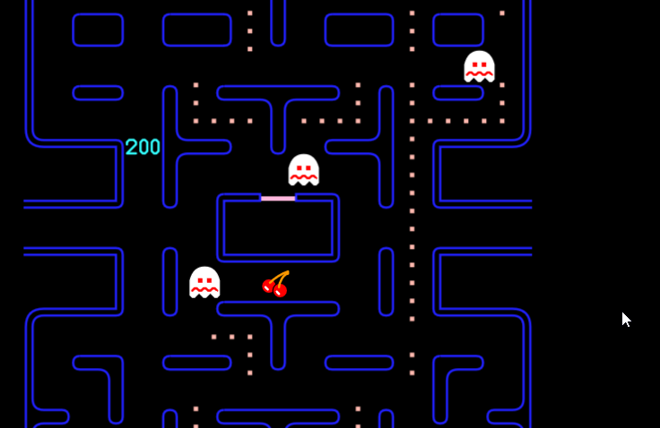

# Challenges

This game of pacman is not much fun yet. It's still missing in so many parts.
So let's make it a challenge to complete the game. 
Hopefully, at the end we will have a super cool pacman game.

To keep track, we recommend you fix the game in the following steps. 

**Please, mind the order.**

Most Challenges are marked in the Code with a comment. 
Just search for `CHALLENGE x` where x is the number of the challenge.

The *basic* challenges come with a solution. 

The *extra* challenges are voluntary work that you can do with the resulting code of the other challenges if you want to.
For these challenges we do not have an example solution.

## Basic
### Challenge - 1

difficulty: very easy

task: Do you hear that? Yeah, me neither. Some sounds are missing. 
That's an easy fix. Just find the function where pacman dies. 
There you can play the sound just like it's played, when a ghost gets eaten.

  
Hint 1

- play the dying sound by calling: `pacman_death_sfx.play()`

 

  
Hint 2

- Pacman dies in the Pacman.py `die()` function

 

### Challenge - 2

in File: Scoring.py

difficulty: easy

task:
Pacman is eating pills, but the score isn't going up? 
Well let's take a look at the add_points_for function in the Scoring.py. 
Seems like it gets called, but the score isn't increased. 
The function gets the variable `eaten` as an argument.
The variable may be: "ghost","pill", "energizer" or the name of a fruit. 
For this game only the "cherry" and "strawberry" are relevant.
The point values are: Pill - 10, Energizer - 50, Ghost - 200, Fruits - see below

  
Hint 1

- increase the variable `self.score` based on the `eaten` argument

### Challenge - 3.1

in File: PillManager.py

difficulty: medium

task: 
So, you ate an energizer (big circle) and nothing happened? 
Maybe take a look at the `eat_pill` function.
In a perfect world you should add points for an energizer 
and make all the ghosts scared. 
When you are finished, you can try to kill a ghost.

  
Hint 1

-  you can get the ghosts from here: `self.game.ghosts`

 

### Challenge - 3.2

in File: Ghost.py

difficulty: easy

task:
Did you manage to kill a ghost? Then you might have witnessed that the game crashes when you do.
That's because the ghosts don't know how to move, when they die.
We wrote the code for how the ghosts should move, 
when they are dead, but we forgot to call it. Can you check, 
if the ghosts mode is "dead" and if it is, call our code?

### Challenge - 4

in File: MainGame.py

difficulty: easy to medium

task: 
I cracked the highscore! But why hasn't it updated?
There is already a file that contains the highscore (high_score.txt), 
but at the moment the highscore does not change. 
After a game is over the update_high_score function in MainGame.py is called. 
Please implement the function so that it updates the highscore file, 
if the current score is higher than the highscore.

  
Hint 1

- maybe you can steal something from the `init_scoring` in the MainGame.py

### Challenge - 5 

in File: MainGame.py

difficulty: medium

task:
Oh no it's game over! Why is there no way to restart the game? 
Currently, the game can't be restarted after a game over. 
Maybe in the `handle_event` function you could react to the space bar key 
and reset all the necessary variables. Only if it's actually game over of course.

  
Hint 1

- the value for the space bar key is stored in is pygame.K_SPACE

 

  
Hint 2

- to remove the game over background you can use `self.screen.fill("black")`

 

  
Hint 3

- for the animations to work you have to adjust the `self.time_for_next_animation`

 

### Challenge - 6

in File: Ghost.py 

difficulty: medium

task: 
This game is way too easy? Of course it is. The ghosts aren't even hunting pacman. 
They just hang out in their corners. We should change that. 
To make a ghost hunt pacman, we just have to call `change_mode("hunt")` in the ghost.
However, the ghosts shouldn't hunt all the time. 
They should scatter for 7 seconds and then hunt for 20 seconds.
This should repeat until they have hunted 5 times. After that: No scattering anymore.
In `movement_logic` there already is an elapsed time that you can use.

  
Hint 1

- remember to reset the `start_time` after changing the mode

 

  
Hint 2

- you can create a variable `self.hunt_count` in the init function
- then increase it for every hunt and stop switching to scatter mode after it hits five

 

  
Is this too easy for you? Then here is an extra task:

Change it so the cycle works as the original game: 
scatter for 7 seconds, then hunt for 20 seconds, 
scatter for 7 seconds, then chase for 20 seconds, 
scatter for 5 seconds, then hunt for 20 seconds, 
scatter for 5 seconds, then switch to hunt mode permanently.

### Challenge - 7

in File: Ghost.py

difficulty: medium

task: 
Did you notice? Clyde and Inky are moving the same, when they hunt for pacman. That's not right.
Clyde is his own person, he needs his own logic. We can change that, 
if we modify the `get_new_direction_for_intersection` function in the Ghost class.
This is how Clyde should move: 
When he is farther apart from pacman than 8 tiles, he should move just like blinky.
When he is closer than 8 tiles, he should move just like he does, when he is in "scatter" mode.

  
Hint 1

- to compute the distance use `math.dist(clyde_pos, pacman_pos)`
- now you just have to find out how to get clydes and pacmans position 
  - (maybe look at the other ghosts for that)

 

### Challenge - 8

in File: Ghost.py

difficulty: medium

task: Are the ghosts even running away, when pacman eats the energizer (big pill)? 
No, normally they change direction, when pacman eats it.
For that to work the ghosts need to change 
to the opposite direction right after starting to be scared.

  
Hint 1

- you only need one line with 2 function calls and 1 variable

 

  
Hint 2

- use `self.change_direction()` and `get_opposite_dir()`

 

### Challenge - 9 

in File: Pacman.py

difficulty: easy

task: 
Pacman only has one life? Doesn't pacman normally have three? 
Maybe we should fix that. Luckily, you only need to change the function `init_hearts` for that.

### Challenge - 10 

in File: Character.py

difficulty: medium

task: 
There is normally a way for pacman to warp from right to left. 
Sadly, the warp seems to be out of order. That shouldn't happen.
You can change the `warp` function to fix it. 
If pacman is currently on a tile that has a 5 or 6 (see game_grid.py), 
he should warp to the other tile.

  
Hint 1

- for a character to move you have to change its `self.x` and `self.y` accordingly

 

  
Hint 2

- use the `map_index_to_coordinates` function to change the grid index to the x and y coordinates

 

## Extra

### Challenge - 12 

in File: Fruit.py and MainGame.py

difficulty: hard

task: 
Aren't there fruits in pacman? Oh, yeah. We already made a class for it 
and called all its functions in the main game, but we forgot to implement them.
Currently, all the calls are commented out. 
Could you implement the fruit class and uncomment the calls?

### Challenge - 13 

in File:MainGame.py

difficulty: hard

task: 
The strawberry and cherry are on top of each other? 
Well, normally a fruit should disappear 9 seconds after spawning.
Can you implement that?

### Challenge - 14 

in File:  MainGame.py

difficulty: hard

task: 
When a fruit or a ghost gets eaten, 
you normally see the points as a little number and pacman shortly disappears.
Maybe you can implement this. Start of by changing the `ghost_collision` function.

### Challenge - 15 

in File: MainGame.py

difficulty: hard

task: Just one level? Nah, we want more. Specify the behavior that happens when pacman has eaten all pills in one level. After 
pacman has eaten all pills level 2 should start. The pills are all on the same position as at the start of level 1. In
the next level the next two fruits are spawning after 70 and 170 pills. (see picture below which fruits this are and how
many points you get for eating them).

