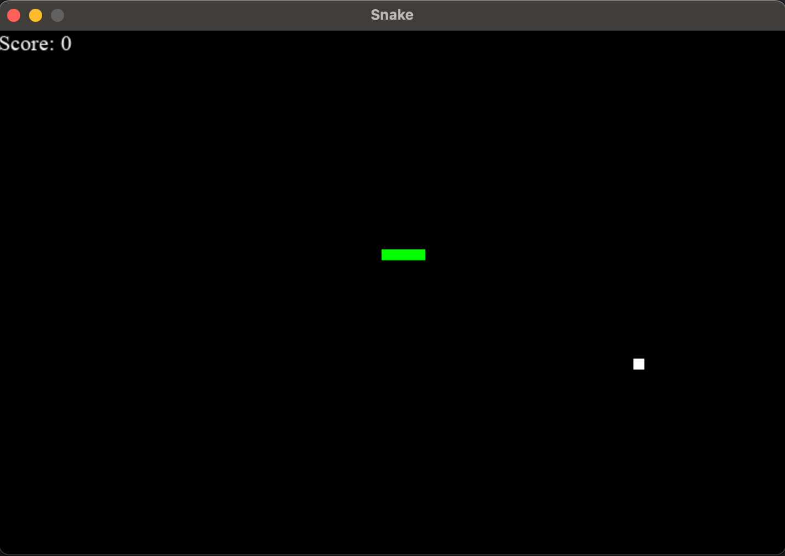

# Snake

Snake is an arcade game in which the player controls long, thin creature consisting out of blocks, the snake, and wants
to eat fruits to get more points and become a longer snake.
This is a simple implementation of the classic Snake game using Python and the Pygame library.

## Visuals

## Dependencies
- python
- pygame
- random

## How to run
1. Make sure you have installed python on your system.
2. Install the pygame library with the command: `pip install pygame`
3. Run the file `main.py`: `python main.py`

## Controls
Use arrow keys to move the snake.

## Rules
- You can move the snake up, down, left and right within a bordered plane (game window).
- One fruit is worth 10 points.
- If you collide with the border of the plane or with your own body, you die.

## Code Structure
This project only has one file, main.py, in which you can find all necessary variables and functions for the game.
The functionalities of the variables and functions are commented in the code.

## Authors
- Sofie Teresa Kalthof
- Leonie Keßler
- Jenny Kozielski
- Isabel Mathea
- Marius Völker

