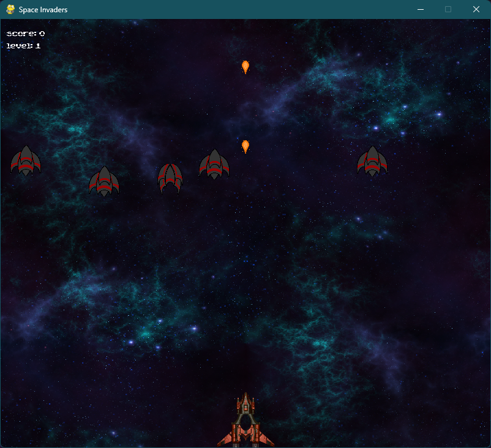

# **Space Invaders**

This is a simple implementation of the classic Space Invaders game using Python and the Pygame library.

**For the challenges for this game check the [Challenges.md](Challenges.md) file.**

## Features

- Single-player game
- Player can control their spaceship using the keyboard
- Player loses and gains lifes
- Scoring system with points depending on enemy type
- Waves of different alien spaceships
- Increasing difficulty per level
- Scoreboard showing top 10 scores

## Visuals

## How to Run

1. Make sure you have Python installed on your system.
2. Install the Pygame library in the command line using pip: `pip install pygame`
3. Run the *main.py* file: `python main.py`

## Dependencies

- Python 3
- Pygame

## Controls

- Use the **4 Arrow Keys** to move forwards, backwards and sideways
- Press **Space** to shoot a laser with the spaceship
- Press **Enter** to start the game
- Press **Space** in the menu to look at highscores of the game
- Press **Esc** to exit the game

## Game Rules

- The player starts at the bottom of the screen and can move on its own
- Players must avoid the enemies and their lasers
- If the player gets hit he loses one life out of three
- Every 5 levels the player gains one life
- If the player loses all three lifes it's game over
- Player must destroy enemies to gain points
- After every 4000 Points the level is increased by one
- All enemies have more health per level but also give more points
- The boss gives 5000 at level 1
- Other enemies give either 300 or 150 points at level 1

## Code Structure

The code is structured into several `.py` files, each with their own functions and classes responsible for a specific part of the game:

- `main.py` : Handles the main loop and goes through the different states of the game.
- `spaceInvaders.py` : Has the game loop and handles all the game mechanics, e.g. levels, spawning, points.
- `player.py` : Controls the player and shoots the laser, gives the characteristics.
- `enemy.py` : Defines all the enemies and gives them their properties like the explosion and size.
- `bullet.py` : Creates the bullet.
- `life.py` : Places the heart on top of the score.
- `background.py` : Gives the scrolling background effect.
- `spritesheet.py` : Handles the spritesheets. Copied and then edited from [here.](https://www.pygame.org/wiki/Spritesheet)
- `score.py` : Loading, saving, sorting and drawing the scores. Copied and then edited from [here.](https://github.com/simon1573/Roadrunner/blob/master/leaderboard.py)
- `startScreen.py` : Displays the startscreen and handles the username.
- `scoreScreen.py` : Displays the current highscore.
- `gameOverScreen.py` : Displays the username and score.

## Authors

>- Ahmed Mansour
>- Tim Baltissen
>- Osama Moharam
>- Veronika Bogdanovich

## Sounds

Sounds used in this project are from [here.](https://opengameart.org/)\
`laser1.mp3` is made by [dklon](https://opengameart.org/users/dklon).\
`gameover.mp3` is made by [crazyduckgames.](https://crazy-duck-games.itch.io/)

## Images

The images used in this project are from [here.](https://www.spriters-resource.com/)\
`PC Computer - Spelunky Classic - Explosion.png` is made by [SpelunkyClassic](https://www.spriters-resource.com/pc_computer/spelunkyclassic/sheet/172126/)\
Heart Image from [here.](https://opengameart.org/content/heart-pixel-art/)
