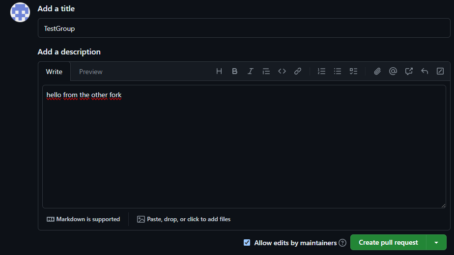

# Welcome to CodeArcade
In this Hackathon, You will work in teams on a pre-built virtual arcade machine to add onto existing games or add your own game with the help from each other and our mentoring team.

We will be using the [PyGame](https://www.pygame.org) library to build an arcade machine with a few games in [Python](https://www.python.org). \
But our games are missing some features that would make the game more fun to play. We believe you can use your creativity combined with your programming skills to make the games more fun to play.

## Getting Started

### Git
1. Download and install [Git](https://git-scm.com/downloads) if you don't have it already
1. Fork this repository ([How to fork a repository](https://docs.github.com/en/get-started/quickstart/fork-a-repo))
1. Clone your forked repository
    <details>
    <summary> Hint: </summary>
        use ` git clone your-forked-repo ` in your terminal from the folder you want to clone the repository to.\
        You can find the link to your forked repository by clicking the green code button in the top right corner of your forked repository.
    </details>

### Python
1. Download and install [Python](https://www.python.org/downloads/)
1. Install [PyGame](https://www.pygame.org/wiki/GettingStarted) 
    <details>
    <summary> Hint: </summary>
        use `pip install pygame` in your terminal after installing Python.
    </details>

### How to run the games
If you've followed the steps above, you should be able to run the games by running the main.py file in the games folder. 
- If you're using an IDE like [PyCharm](https://www.jetbrains.com/pycharm/) or [vscode](https://code.visualstudio.com/), you can run the [main.py](main.py) file by clicking the green play button in the top right corner. 
- If you're using a terminal, you can run the main.py file by typing `python main.py` in the terminal from the repository folder you cloned earlier. 

Now you're ready to start playing!  🎉🎉🎉

## The Arcade Machine
When you run the main.py file, you should see a window like this pop up: 


This is the arcade machine. You can use the arrow keys to navigate the menu and press enter to start the selected game.

The arcade machine displays the games that are in the games folder and registered in it. When you start a game, the arcade machine will run the main game file from inside the game folder.

The main game file is not necessarily called main.py, but it is the file used when registering the game in the arcade machine. \
For example, the racing game is registered like this; the main game file is called game.py.

```python
# main.py
machine.register_game(ArcadeGame("Mumble Club", "games/aracinggame/game.py",
                                     "hard", "3-4 h", "assets/example_pictures/racinggame.png",
                                     "Singeplayer game. Drive faster than your friends and become the master of the road!",
                                     "Procedural code. Help the timekeeper find his stolen watch by coding!"))
```

### Want to add your own game?
1. Create a new folder in the games folder
1. write your game code
1. register your game in the main.py file with some description as shown in the example above

et voilà! your game is now in the arcade machine. 

## Existing games
We have already made a few games that you can add onto. You can find them in the [games folder](games). \
But as you can see, they are missing some features that would make the game more fun to play. We believe you can use your creativity combined with your programming skills to make the games more fun to play.

For each game, we have made a README file with some explanation about the game and ideas (as well as hints) on what you can add to the game. Have a look at them:

- [Snake](games/snake/README.md)  
- [Pong](games/pong/README.md)    
- [Space_invaders](games/space_invaders/README.md)  
- [Pacman](games/pacman/README.md)  
- [Pinball](games/pinball/README.md)  
- [Racing game](games/aracinggame/README.md)  

## Contributing
Done with all the games? Great! Now you can help us improve the arcade machine. \
we would like to receive your upgraded version of the arcade machine in a [pull request](https://docs.github.com/en/get-started/quickstart/contributing-to-projects#making-a-pull-request). 

1. Make sure your work is up to date and pushed to your forked repository's main branch.
1. Create a pull request from your forked repository to this repository's main branch.
    1. Github should automatically detect that you're making a pull request from a forked repository. Go ahead and click the green button to create the pull request.
    
    
    1. Please ensure that the title of the pull request is your group name. In the description, let us know if there is anything else we should know about your pull request.
     

And That's it! We now have your upgraded version of the arcade machine and will use it for furhter evaluation of our study.\
Make sure to finish your pull request before the end of the hackathon since we will only review changes made until the end of the Event.
